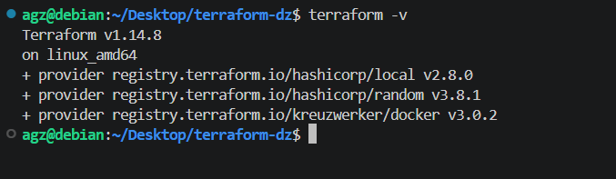
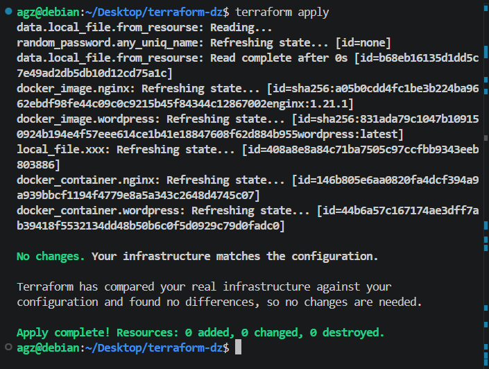
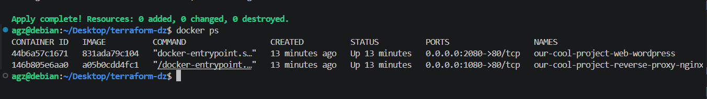
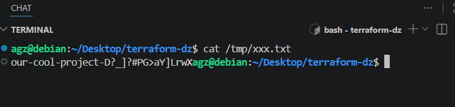

# Домашнее задание к занятию "`Название занятия`" - `Фамилия и имя студента`

# Домашнее задание к занятию «Terraform»

**Это задание для самостоятельной отработки навыков и не предполагает обратной связи от преподавателя. Его выполнение не влияет на завершение модуля. Но мы рекомендуем не откладывать его выполнение, так как в следующем домашнем задании вы будете использовать Terraform для решения рабочей задачи.**

### Задание

1. Установите Terraform на компьютерную систему (виртуальную или хостовую), используя лекцию или [инструкцию](https://learn.hashicorp.com/tutorials/terraform/install-cli).  download: https://hashicorp-releases.yandexcloud.net/terraform/

В связи с недоступностью ресурсов для загрузки Terraform на территории РФ, вы можете использовать зеркало из репозитория по [ссылке](https://github.com/netology-code/devops-materials).

2. Повторите демо из лекции!
документация провайдеров: https://library.tf/providers

